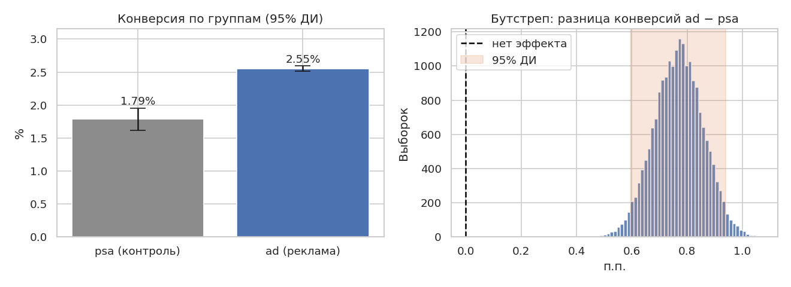
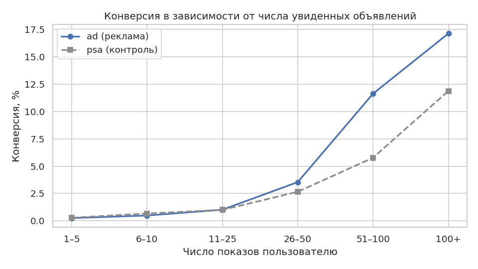

# A/B-тест рекламной кампании

Анализ A/B-теста на 588 тыс. пользователей: влияет ли реклама на покупки и сколько дополнительных продаж она принесла.

**Итог: реклама работает.** Конверсия в группе с рекламой 2.55% против 1.79% в контроле (**+0.77 п.п., +43%**), результат статистически значим (p ≈ 10⁻¹³). Кампания принесла ≈4.3 тыс. дополнительных покупок, то есть около 30% всех покупок в группе с рекламой.

📓 Полный анализ с кодом: [`ab_test_ad_campaign.ipynb`](ab_test_ad_campaign.ipynb)

## Задача

Одним пользователям показывали рекламу продукта (`ad`), другим — нейтральное общественное объявление (`psa`, контроль). Нужно оценить эффект рекламы на покупки и перевести его в язык бизнеса.

**Метрика:** конверсия в покупку.

## Что сделано

1. Проверка данных и дизайна эксперимента (дисбаланс групп 96/4, расчёт минимального обнаружимого эффекта).
2. Проверка сопоставимости групп по числу показов, дню и времени.
3. z-тест для двух долей, доверительный интервал и бутстреп.
4. Перевод результата в бизнес-метрики: дополнительные покупки на 1 000 пользователей.
5. Проверка устойчивости: пересчёт эффекта с поправкой на день недели и время суток.
6. Анализ по сегментам (день недели, время суток).
7. Анализ зависимости конверсии от числа показов и разбор того, почему из него нельзя делать причинные выводы.

## Результаты

| Показатель | psa (контроль) | ad (реклама) | Результат |
|---|---|---|---|
| Конверсия | 1.79% | 2.55% | +0.77 п.п. (+43%), 95% ДИ [0.60; 0.94] п.п. |
| Дополнительных покупок | | | ≈4.3 тыс. (ДИ 3.4–5.3 тыс.) |



**Главное наблюдение.** Конверсия растёт с числом показов в обеих группах, в том числе в контрольной. Значит, число показов отражает активность пользователя, а не силу рекламы. Практически весь прирост приходится на активных пользователей (26+ показов), а у остальных (73% аудитории) эффекта не обнаружено. Это гипотеза для следующего эксперимента со случайно назначаемой частотой показов.



## Ограничения

- В данных нет стоимости показов и выручки, поэтому ROI оценить нельзя.
- Контрольная группа маленькая (4%), поэтому сегментный анализ шумный.
- Небольшой перекос по дням недели между группами; поправка на него результат не изменила.

## Стек

Python · Pandas · NumPy · SciPy · Matplotlib · Seaborn · Jupyter

## Как запустить

```bash
pip install -r requirements.txt
# скачайте marketing_AB.csv (ссылка в data/README.md) в папку data/
jupyter notebook ab_test_ad_campaign.ipynb
```

## Структура

```
├── ab_test_ad_campaign.ipynb   # анализ
├── data/                       # датасет (скачивается отдельно)
├── images/                     # графики
└── requirements.txt
```
